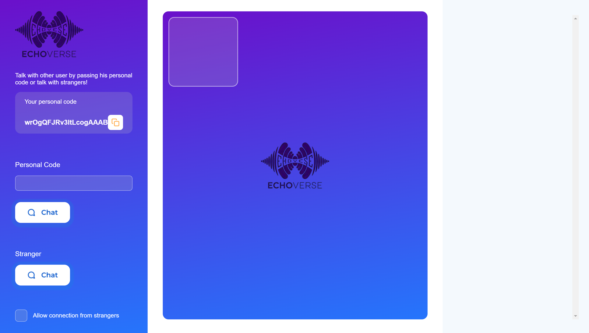
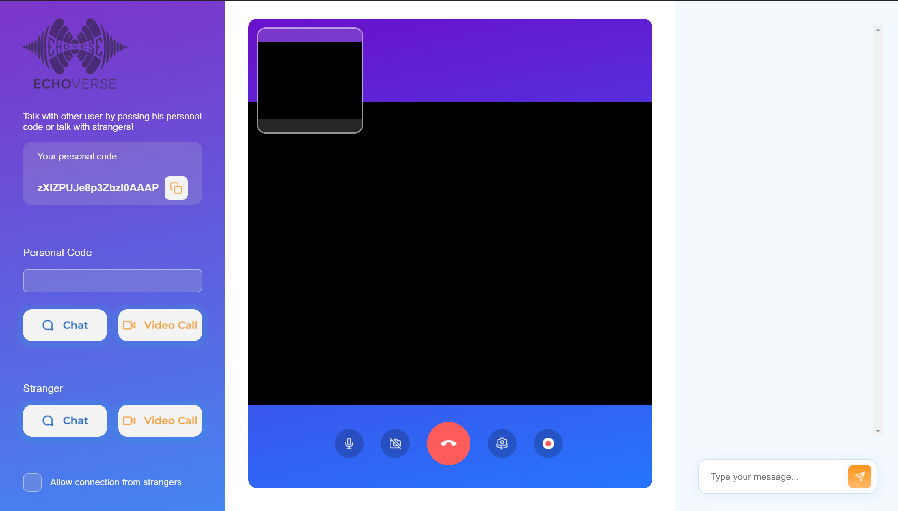

Here’s the updated `README.md` file with emojis for a more engaging and lively presentation:

---

# **EchoVerse** 🌌

### A Chat and Video Call App with Stranger Connectivity 🌐🎥💬

Welcome to **EchoVerse**, a dynamic chat and video call platform that connects you with friends, acquaintances, or strangers! Whether you're sharing personal codes for private calls or diving into the randomness of meeting new people, EchoVerse has you covered.  

---

## **✨ Features**
- 🔑 **Personal Code Sharing**: Share a unique personal code to connect securely with others for video calls or chat.  
- 🌍 **Stranger Mode**: Meet new people by enabling the *Talk to a Stranger* feature.  
- 📹 **Video Calls & Chat**: Seamlessly connect via video or text-based conversations.  
- 🖥️ **Screen Sharing**: Share your screen for presentations, tutorials, or collaborative discussions.  
- 🎥 **Screen Recording**: Record your interactions or meetings with a single click.  
- 🎛️ **Camera & Mic Controls**: Easily toggle your camera and microphone on or off for better control.  

---

## **🚀 How It Works**
1. **👥 Private Connection**:  
   - Share your **personal code** with someone you know.  
   - Paste their code and choose between **Video Call** 🎥 or **Chat** 💬 to connect.  
2. **🌟 Stranger Mode**:  
   - Enable the "Talk to a Stranger" checkbox.  
   - Click on **Video Call** 🎥 or **Chat** 💬 to connect with a random stranger.  
3. **🎛️ Control Your Experience**:  
   - Use the built-in buttons for **Screen Sharing** 🖥️, **Screen Recording** 🎥, and **Camera/Mic Toggling** 🔇.

---

## **⚙️ Installation**
Follow these steps to set up EchoVerse locally:

1. Clone the repository:  
   ```bash
   git clone https://github.com/your-username/echoverse.git
   ```
2. Navigate to the project folder:  
   ```bash
   cd echoverse
   ```
3. Install dependencies:  
   ```bash
   npm install
   ```
4. Start the development server:  
   ```bash
   npm start
   ```
5. Open your browser and navigate to:  
   ```
   http://localhost:3000
   ```

---

## **💻 Tech Stack**
- 🌐 **Frontend**: React.js  
- 🖥️ **Backend**: Node.js with Express  
- 💾 **Database**: MongoDB  
- 📡 **WebRTC**: For real-time communication  
- 🎨 **Styling**: Tailwind CSS  

---

## **📸 Screenshots**
  
*💬 Chat interface with options to connect using personal codes or meet strangers.*  

  
*🎥 Seamless video calling experience with camera and mic toggles.*

---

## **🤝 Contributing**
Contributions are welcome! 🌟 Follow these steps to contribute:

1. Fork the repository. 🍴  
2. Create a new branch:  
   ```bash
   git checkout -b feature-name
   ```
3. Commit your changes:  
   ```bash
   git commit -m "Add a new feature"
   ```
4. Push your changes:  
   ```bash
   git push origin feature-name
   ```
5. Open a Pull Request. 🛠️

---

## **📬 Contact**
Have questions or suggestions? Reach out!  
📧 **Email**: [madhavtiwari2024@gmail.com](mailto:madhavtiwari2024@gmail.com)  
🐙 **GitHub**: [ermadhav](https://github.com/ermadhav)  

---

With **EchoVerse**, the world is just a click away. 🌟 Dive in and start connecting today! 🌍

---

This version adds a splash of personality and fun with emojis. You can update the placeholders and paths as needed. 😊
